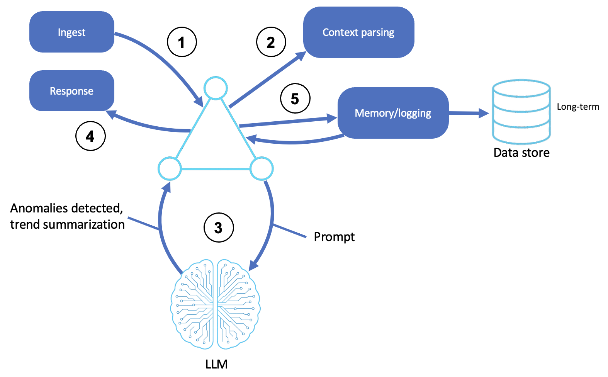

# Observer and Monitoring Agents

Agents that passively watch a system and use LLM reasoning to flag anomalies and raise alerts.

This sample builds observer agents over simulated telemetry with the [Strands Agents SDK](https://strandsagents.com/), and is based off of the [AWS Prescriptive Guidance - Observer and monitoring agents pattern](https://docs.aws.amazon.com/prescriptive-guidance/latest/agentic-ai-patterns/observer-and-monitoring-agents.html).

## Table of Contents

- [Quick Start](#quick-start)
- [Observer Patterns](#observer-patterns)
  - [How It Works](#how-it-works)
  - [Log Analyzer](#log-analyzer)
  - [Drift Detector](#drift-detector)
  - [Compliance Monitor](#compliance-monitor)
- [AWS Implementation Patterns](#aws-implementation-patterns)
- [Reference](#reference)

## Quick Start

**Prerequisites:**
- Python 3.10+
- An AWS account with Amazon Bedrock access
- AWS credentials configured (`aws configure`) with permission to invoke models on Bedrock

```bash
# Create and activate virtual environment
python3 -m venv venv
source venv/bin/activate  # On Windows: venv\Scripts\activate

# Install dependencies
pip install -r requirements.txt

# Point the sample at your AWS profile and region (loaded by shared/model.py)
cp .env.example .env
# Edit .env: set AWS_PROFILE and AWS_REGION. Optionally pin a model with STRANDS_MODEL_ID.

# Run any of the three observer agents
python log_analyzer.py        # detect anomalies in a log stream
python drift_detector.py      # spot quality degradation over time
python compliance_monitor.py  # flag policy violations in activity
```

> **Note:** All three agents observe **simulated** telemetry so they run from a clean clone with only Bedrock. In production, the same agents would ingest real telemetry from sources like Amazon CloudWatch, Amazon EventBridge, or Amazon Kinesis Data Streams. These observers are passive by design: they detect and report, they don't remediate.

**Try these exercises:**
1. **Tune the noise.** Using the `log analyzer agent`, raise the `anomaly_rate` and see how the agent's severity classification changes with a noisier stream.
2. **Watch drift emerge.** Experiment with the `drift detector agent` and observe how it flags the simulated agent's quality dropping over successive samples.
3. **Catch a violation.** Run the `compliance monitor agent` and trace how it identifies and explains a policy breach in the activity stream.
4. **Add a rule.** Give the compliance monitor a new policy in its prompt and confirm it flags matching behavior.

---

## Observer Patterns

An observer agent sits *beside* a system rather than inside it. It ingests telemetry, reasons over it with an LLM, and decides whether something warrants an alert. That passivity is the defining trait: observers turn noisy, unstructured signals into human-understandable reports, escalating when necessary and leaving action to humans or downstream agents. This sample builds three: one over **logs**, one over **agent quality**, one over **user activity**.

### How It Works

1. **Ingest telemetry**: the agent receives input from system sources
2. **Parse context**: raw input is parsed, structured, and enriched with metadata
3. **Reason using an LLM**: the agent interprets the parsed input
4. **Classify or alert**: the agent decides whether the behavior warrants an alert/escalation, a report or dashboard update, or a response trigger
5. **Log memory or feedback**: events and decisions are stored for long-term learning, audits, or use by other agents



### Log Analyzer

The [log analyzer](log_analyzer.py) ingests a stream of application logs and reasons about what actually matters. Rather than matching fixed patterns, it interprets the logs in context, classifies severity, and explains *why* something is anomalous:

```python
class LogStream:
    """Generates realistic application logs with occasional anomalies."""
    def generate_batch(self, count=20, anomaly_rate=0.3) -> list: ...

# the agent reads a batch and reasons about severity and root cause
```

This is the canonical observer loop: ingest → parse → reason → classify. It shows where LLMs beat regex rules: a "connection timeout" line at 3am during a documented maintenance window is benign; the same line at 2pm on a Tuesday might be an incident. A pattern matcher reads only the line and requires additional monitoring setup; the LLM reads the situation.

### Drift Detector

The [drift detector](drift_detector.py) watches another agent's output quality over time and flags **drift**, i.e. gradual degradation and behavioral change. It samples a simulated agent whose responses get worse, and reasons about whether quality is slipping:

```python
class SimulatedAgent:
    """Simulates an agent whose quality degrades over time."""
```

Agents can degrade for reasons that are hard to spot from inside the agent itself:

- **The world changed:** Product catalogs, policies, and APIs evolve, leaving the agent's training and prompts stale.
- **The input changed:** Users start asking questions the agent wasn't designed for, and accuracy slips on the new shapes.
- **The model changed:** A foundation model version update can shift behavior on identical prompts.
- **The prompt accumulated debt:** Iterative tweaks to fix specific cases pile up into a prompt that no longer holds together.
- **The tools or context changed:** Downstream APIs return different shapes, rate limits tighten, or memory summaries lose fidelity.

None of these throw exceptions. The agent keeps responding; the responses just get a little worse, a little weirder, or a little more often wrong. Drift detection is observation turned inward, monitoring AI with AI. It's how you catch a model that's quietly getting worse before users do.

### Compliance Monitor

The [compliance monitor](compliance_monitor.py) watches a stream of user activity and flags **policy violations**, building an audit trail as it goes. Because the policies live in the prompt as natural language, it can catch nuanced violations a rigid rule wouldn't:

```python
class ActivityStream:
    """Generates user activity events, some of which violate policies."""
```

This is the compliance and security angle of observation: reasoning over unstructured behavior to surface what a human auditor would care about.

---

## AWS Implementation Patterns

| Pattern | Description | Reference |
|---------|-------------|-----------|
| Agent observability | Build trustworthy agents with Amazon Bedrock AgentCore Observability | [Build trustworthy AI agents with Amazon Bedrock AgentCore Observability](https://aws.amazon.com/blogs/machine-learning/build-trustworthy-ai-agents-with-amazon-bedrock-agentcore-observability/) |
| Operationalizing agents | Operationalize agentic AI at scale with AgentOps on AgentCore | [AgentOps: Operationalize agentic AI at scale with Amazon Bedrock AgentCore](https://aws.amazon.com/blogs/machine-learning/agentops-operationalize-agentic-ai-at-scale-with-amazon-bedrock-agentcore/) |
| Ambient monitoring agents | Proactive AWS monitoring with always-on ambient agents | [AgentWatch: Proactive AWS monitoring with ambient agents](https://aws.amazon.com/blogs/machine-learning/agentwatch-proactive-aws-monitoring-with-ambient-agents/) |
| LLM-driven log analysis | How Palo Alto Networks enhanced security log analysis with Amazon Bedrock | [How Palo Alto Networks enhanced device security infra log analysis with Amazon Bedrock](https://aws.amazon.com/blogs/machine-learning/how-palo-alto-networks-enhanced-device-security-infra-log-analysis-with-amazon-bedrock/) |

## Reference

- [Companion blog post: Watching the Watched](Watching%20the%20Watched%20-%20Observer%20and%20Monitoring%20Agents.md)
- [AWS Prescriptive Guidance - Observer and monitoring agents](https://docs.aws.amazon.com/prescriptive-guidance/latest/agentic-ai-patterns/observer-and-monitoring-agents.html)
- [Amazon Bedrock AgentCore Observability](https://docs.aws.amazon.com/bedrock-agentcore/latest/devguide/observability.html)
- [Strands Agents Documentation](https://strandsagents.com/)
- [Amazon Bedrock User Guide](https://docs.aws.amazon.com/bedrock/latest/userguide/what-is-bedrock.html)

### The series

This sample is one of eleven, one per pattern in the [AWS Prescriptive Guidance on agentic AI patterns](https://docs.aws.amazon.com/prescriptive-guidance/latest/agentic-ai-patterns/). Each has a hands-on sample repository and a companion blog post explaining the concepts.

| # | Pattern | Sample | Blog |
|---|---|---|---|
| 01 | Basic Reasoning Agents | [sample-basic-reasoning-agents](https://github.com/aws-samples/sample-basic-reasoning-agents) | [Building Basic Reasoning Agents with Amazon Bedrock and Strands SDK](https://github.com/aws-samples/sample-basic-reasoning-agents/blob/main/Building%20Basic%20Reasoning%20Agents%20with%20Amazon%20Bedrock%20and%20Strands%20SDK.md) |
| 02 | Tool-Based Agents (Functions) | [sample-tool-based-agents-functions](https://github.com/aws-samples/sample-tool-based-agents-functions) | [Extending AI Agents with Custom Tools and Functions](https://github.com/aws-samples/sample-tool-based-agents-functions/blob/main/Extending%20AI%20Agents%20with%20Custom%20Tools%20and%20Functions.md) |
| 03 | Tool-Based Agents (Servers) | [sample-tool-based-agents-servers](https://github.com/aws-samples/sample-tool-based-agents-servers) | [Delegating Work: Tool Servers and the Model Context Protocol](https://github.com/aws-samples/sample-tool-based-agents-servers/blob/main/Delegating%20Work%20-%20Tool%20Servers%20and%20the%20Model%20Context%20Protocol.md) |
| 04 | Computer-Use Agents | [sample-computer-use-agents](https://github.com/aws-samples/sample-computer-use-agents) | [Agents That Use Computers: Browsers, Desktops, and the GUI Frontier](https://github.com/aws-samples/sample-computer-use-agents/blob/main/Agents%20That%20Use%20Computers%20-%20Browsers%2C%20Desktops%2C%20and%20the%20GUI%20Frontier.md) |
| 05 | Coding Agents | [sample-coding-agents](https://github.com/aws-samples/sample-coding-agents) | [Coding Agents: From Autocomplete to Autonomous Software Work](https://github.com/aws-samples/sample-coding-agents/blob/main/Coding%20Agents%20-%20From%20Autocomplete%20to%20Autonomous%20Software%20Work.md) |
| 06 | Speech and Voice Agents | [sample-speech-voice-agents](https://github.com/aws-samples/sample-speech-voice-agents) | [Giving Agents a Voice: Speech-to-Speech and the STT/TTS Pipeline](https://github.com/aws-samples/sample-speech-voice-agents/blob/main/Giving%20Agents%20a%20Voice%20-%20Speech-to-Speech%20and%20the%20STT-TTS%20Pipeline.md) |
| 07 | Workflow Orchestration Agents | [sample-workflow-orchestration-agent](https://github.com/aws-samples/sample-workflow-orchestration-agent) | [Orchestrating Agents: Sequential, Parallel, and Conditional Workflows](https://github.com/aws-samples/sample-workflow-orchestration-agent/blob/main/Orchestrating%20Agents%20-%20Sequential%2C%20Parallel%2C%20and%20Conditional%20Workflows.md) |
| 08 | Memory-Augmented Agents | [sample-memory-augmented-agents](https://github.com/aws-samples/sample-memory-augmented-agents) | [Agents That Remember: Context Windows, Summaries, and Persistent Sessions](https://github.com/aws-samples/sample-memory-augmented-agents/blob/main/Agents%20That%20Remember%20-%20Context%20Windows%2C%20Summaries%2C%20and%20Persistent%20Sessions.md) |
| 09 | Simulation and Test-Bed Agents | [sample-simulation-testbed-agents](https://github.com/aws-samples/sample-simulation-testbed-agents) | [Practice Worlds: Simulation and Test-Bed Agents](https://github.com/aws-samples/sample-simulation-testbed-agents/blob/main/Practice%20Worlds%20-%20Simulation%20and%20Test-Bed%20Agents.md) |
| 10 | Observer and Monitoring Agents | this repository | [Watching the Watched: Observer and Monitoring Agents](Watching%20the%20Watched%20-%20Observer%20and%20Monitoring%20Agents.md) |
| 11 | Multi-Agent Collaboration | [sample-multi-agent-collaboration](https://github.com/aws-samples/sample-multi-agent-collaboration) | [When Multi-Agent Collaboration Earns Its Cost](https://github.com/aws-samples/sample-multi-agent-collaboration/blob/main/When%20Multi-Agent%20Collaboration%20Earns%20Its%20Cost.md) |

## Security

See [CONTRIBUTING](CONTRIBUTING.md#security-issue-notifications) for more information.

## License

This library is licensed under the MIT-0 License. See the LICENSE file.
